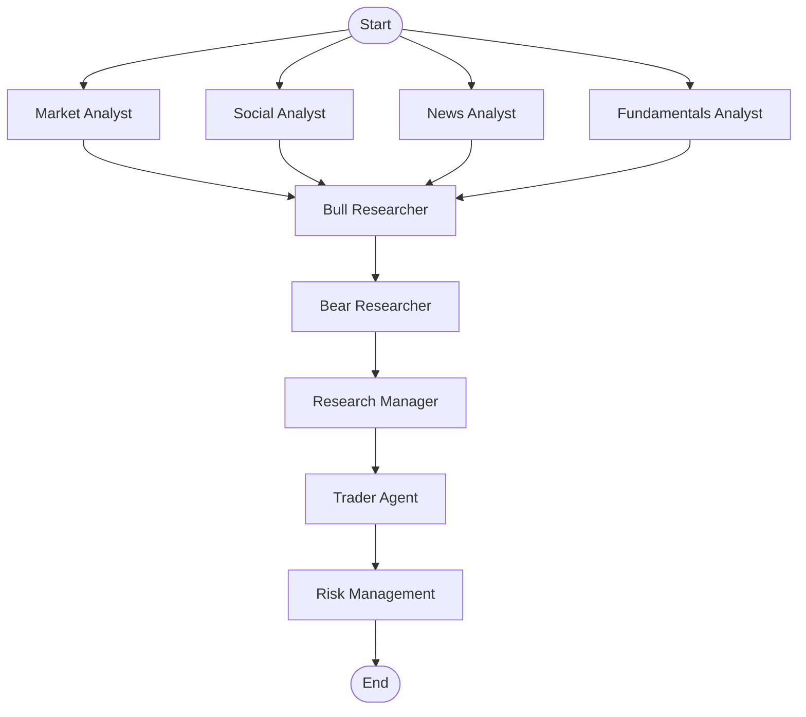

# Workflow Visualization & Monitoring - Brainstorming Document

## 🎯 Goal

Create a **visual representation** of the entire TradingAgents workflow showing:
- Agent 1 → Agent 2 → Agent 3 → Agent 4... (sequential flow)
- Parallel execution (e.g., 4 analysts running simultaneously)
- Conditional branches (e.g., debate loops, risk checks)
- Real-time status (which agent is currently executing)
- Historical execution traces (what happened in past runs)

---

## 📊 Current Workflow Structure

Based on your TradingAgents system:

```
START
  ↓
[ANALYST TEAM - Parallel]
  ├─→ Market Analyst
  ├─→ Social Media Analyst  
  ├─→ News Analyst
  └─→ Fundamentals Analyst
  ↓
[RESEARCH TEAM - Sequential Debate]
  ├─→ Bull Researcher
  ├─→ Bear Researcher (conditional loop)
  └─→ Research Manager
  ↓
[TRADING TEAM]
  └─→ Trader Agent
  ↓
[RISK MANAGEMENT TEAM - Sequential Debate]
  ├─→ Aggressive Analyst
  ├─→ Conservative Analyst
  ├─→ Neutral Analyst
  └─→ Portfolio Manager (final decision)
  ↓
END
```

**Total: 13 agents across 5 teams**

---

## 🔍 What Langfuse Provides

### ✅ What Langfuse DOES:
- **Trace View**: Shows individual LLM calls with inputs/outputs
- **Timeline View**: Chronological execution order
- **Cost Tracking**: Per-agent token usage and costs
- **Latency Metrics**: How long each step took
- **Quality Scores**: If you add scoring

### ⚠️ What Langfuse DOESN'T Provide:
- **Workflow Diagram**: Visual graph showing agent relationships
- **Real-time Status**: Live view of "Agent X is currently running"
- **Interactive Flow**: Click-through workflow exploration
- **Static Architecture Diagram**: High-level system overview

**Verdict**: Langfuse is excellent for **debugging traces** but not ideal for **workflow visualization**.

---

## 🛠️ Open-Source Visualization Tools

### Option 0: N8N-Style Workflow Visualizers ⭐⭐⭐ **MOST SIMILAR TO N8N**

These tools provide the **exact N8N-style drag-and-drop workflow visualization** you're looking for:

---

#### **Flowise** ⭐⭐⭐ **BEST FOR LANGCHAIN/LANGGRAPH**

**What it is:** Open-source low-code platform built on LangChain/LlamaIndex with N8N-style visual workflow builder

**Key Features:**
- ✅ **Drag-and-drop interface** - Just like N8N
- ✅ **Built for LangChain** - Native support for your stack
- ✅ **Real-time execution visualization** - See nodes light up as they execute
- ✅ **Multi-agent support** - Can visualize agent workflows
- ✅ **Self-hosted** - Docker deployment available
- ✅ **Beautiful UI** - Modern, polished interface

**How it works:**
- Can import/visualize LangChain workflows
- Shows nodes connected by edges (exactly like N8N)
- Real-time status updates during execution
- Click nodes to see details, inputs/outputs

**Architecture:**
```
Your LangGraph → Flowise API → Flowise UI (N8N-style visualization)
```

**Pros:**
- ✅ **Purpose-built for LangChain** - Perfect fit
- ✅ **N8N-like interface** - Familiar drag-and-drop experience
- ✅ **Real-time visualization** - See execution as it happens
- ✅ **Can potentially import your workflow** - Or rebuild visually
- ✅ **Open source** - Free, self-hosted

**Cons:**
- ⚠️ **May need to adapt workflow** - Might need to map LangGraph to Flowise format
- ⚠️ **Primarily a builder** - Designed for building workflows, not just visualizing
- ⚠️ **Learning curve** - Need to understand Flowise concepts

**Best for:** LangChain/LangGraph workflows, N8N-style visualization, real-time monitoring

**Resources:**
- Website: https://flowise.ai/
- GitHub: https://github.com/FlowiseAI/Flowise
- Docker: https://docs.flowise.ai/deployment/docker
- LangChain integration: https://docs.flowise.ai/integrations/langchain

---

#### **Node-RED** ⭐⭐ **MOST N8N-LIKE**

**What it is:** Flow-based visual programming tool, very similar to N8N

**Key Features:**
- ✅ **N8N-style interface** - Drag-and-drop nodes
- ✅ **Real-time execution** - Nodes light up during execution
- ✅ **Browser-based editor** - No installation needed
- ✅ **Highly customizable** - Can create custom nodes
- ✅ **WebSocket support** - Real-time updates

**Pros:**
- ✅ **Very similar to N8N** - Familiar interface
- ✅ **Mature and stable** - Battle-tested
- ✅ **Large community** - Lots of examples
- ✅ **Can integrate with Python** - Via HTTP/WebSocket

**Cons:**
- ❌ **Not LangChain-native** - Would need custom integration
- ❌ **Primarily for IoT/automation** - Not designed for AI workflows
- ❌ **Would need custom nodes** - To represent your agents

**Best for:** If you want N8N-style UI but need to build custom integration

**Resources:**
- Website: https://nodered.org/
- GitHub: https://github.com/node-red/node-red

---

#### **AutoGen Studio** ⭐⭐ **MULTI-AGENT FOCUSED**

**What it is:** No-code tool for building and debugging multi-agent systems

**Key Features:**
- ✅ **Multi-agent visualization** - Shows agent interactions
- ✅ **Web interface** - Browser-based
- ✅ **Real-time debugging** - See agent execution
- ✅ **Built for LLM agents** - Purpose-built for your use case

**Pros:**
- ✅ **Agent-focused** - Designed for multi-agent systems
- ✅ **Visual interface** - Shows agent workflows
- ✅ **Real-time monitoring** - See execution as it happens

**Cons:**
- ⚠️ **Microsoft AutoGen** - Uses AutoGen framework (not LangGraph)
- ⚠️ **Would need migration** - Can't directly use LangGraph workflows
- ⚠️ **Less mature** - Newer project

**Best for:** If you're willing to migrate to AutoGen framework

**Resources:**
- GitHub: https://github.com/microsoft/autogen-studio

---

#### **Apache NiFi** ⭐ **DATA FLOW FOCUSED**

**What it is:** Visual data flow automation tool

**Key Features:**
- ✅ **N8N-style interface** - Drag-and-drop
- ✅ **Real-time monitoring** - See data flowing
- ✅ **Mature platform** - Enterprise-grade

**Cons:**
- ❌ **Data-focused** - Not designed for AI agent workflows
- ❌ **Heavy** - Complex setup
- ❌ **Would need significant adaptation** - Not ideal fit

**Best for:** Data pipeline visualization (not recommended for agents)

---

### Option 1: LangGraph Built-in Visualization ⭐ **EASIEST**

**What it is:** LangGraph has built-in visualization capabilities

**Pros:**
- ✅ Already using LangGraph - no new dependencies
- ✅ Automatic graph generation from your workflow definition
- ✅ Shows nodes, edges, conditional branches
- ✅ Can export as PNG/SVG
- ✅ Interactive HTML output

**Cons:**
- ❌ Static diagram (not real-time execution view)
- ❌ Basic styling (not highly customizable)
- ❌ Doesn't show execution state (which agent is running)

**Example:**
```python
from langgraph.graph import StateGraph
from IPython.display import Image, display

# Your existing graph
graph = StateGraph(...)

# Visualize
display(Image(graph.get_graph().draw_mermaid_png()))
```

**Best for:** Architecture documentation, static workflow diagrams

**Resources:**
- LangGraph visualization: https://langchain-ai.github.io/langgraph/how-tos/visualization/

---

### Option 2: Mermaid Diagrams (Static) ⭐ **GOOD FOR DOCS**

**What it is:** Markdown-based diagram syntax, renders to SVG/PNG

**Pros:**
- ✅ Free and open source
- ✅ Version-controlled (text-based)
- ✅ Can embed in Markdown docs
- ✅ Multiple diagram types (flowchart, sequence, gantt)
- ✅ GitHub/GitLab render automatically

**Cons:**
- ❌ Static only (not interactive)
- ❌ Not real-time
- ❌ Manual updates needed

**Example:**


**Best for:** Documentation, architecture diagrams, README files

**Resources:**
- Mermaid: https://mermaid.js.org/
- Live editor: https://mermaid.live/

---

### Option 3: React Flow / Cytoscape.js (Interactive Web UI) ⭐ **BEST FOR INTERACTIVE**

**What it is:** JavaScript libraries for interactive node-based graphs

**React Flow:**
- ✅ Modern React-based
- ✅ Highly customizable
- ✅ Interactive (zoom, pan, drag)
- ✅ Can show real-time status (color nodes by state)
- ✅ Can add custom controls/panels

**Cytoscape.js:**
- ✅ More mature, battle-tested
- ✅ Better for complex graphs
- ✅ More layout algorithms
- ✅ Can integrate with backend

**Pros:**
- ✅ Beautiful, interactive visualizations
- ✅ Can show real-time execution status
- ✅ Click nodes to see details
- ✅ Customizable styling
- ✅ Can embed in Chainlit or separate dashboard

**Cons:**
- ❌ Requires frontend development (React/JavaScript)
- ❌ Need to build custom UI
- ❌ More development time

**Architecture:**
```
Your Python App → API → React Frontend → React Flow Visualization
```

**Best for:** Interactive dashboards, real-time monitoring UI, custom visualization needs

**Resources:**
- React Flow: https://reactflow.dev/
- Cytoscape.js: https://js.cytoscape.org/
- Example: https://github.com/wbkd/react-flow

---

### Option 4: Graphviz (Programmatic Diagrams) ⭐ **GOOD FOR AUTO-GENERATION**

**What it is:** Graph visualization software, generates diagrams from text descriptions

**Pros:**
- ✅ Can generate programmatically from your code
- ✅ Multiple output formats (PNG, SVG, PDF)
- ✅ Automatic layout algorithms
- ✅ Can update automatically as workflow changes
- ✅ Well-established tool

**Cons:**
- ❌ Static diagrams (not interactive)
- ❌ Learning curve for DOT syntax
- ❌ Less modern-looking than React Flow

**Example:**
```python
from graphviz import Digraph

dot = Digraph(comment='TradingAgents Workflow')
dot.node('A', 'Market Analyst')
dot.node('B', 'Bull Researcher')
dot.edge('A', 'B')
dot.render('workflow.gv', view=True)
```

**Best for:** Auto-generated documentation, CI/CD diagrams, programmatic visualization

**Resources:**
- Graphviz: https://graphviz.org/
- Python wrapper: `pip install graphviz`

---

### Option 5: D3.js (Custom Visualization) ⭐ **MOST FLEXIBLE**

**What it is:** JavaScript library for data-driven visualizations

**Pros:**
- ✅ Maximum flexibility
- ✅ Can create any visualization style
- ✅ Great for custom requirements
- ✅ Can show real-time updates
- ✅ Beautiful, professional results

**Cons:**
- ❌ Steep learning curve
- ❌ Significant development time
- ❌ Requires JavaScript expertise

**Best for:** Custom visualization needs, unique requirements, maximum control

**Resources:**
- D3.js: https://d3js.org/
- Examples: https://observablehq.com/@d3

---

### Option 6: Apache Airflow UI (Workflow Orchestration) ⚠️ **MAYBE OVERKILL**

**What it is:** Workflow orchestration platform with built-in visualization

**Pros:**
- ✅ Purpose-built for workflows
- ✅ Real-time execution status
- ✅ Historical run views
- ✅ Task dependencies visualization
- ✅ Built-in monitoring

**Cons:**
- ❌ Overkill for your use case (you're using LangGraph, not Airflow)
- ❌ Would require rewriting workflow in Airflow DAGs
- ❌ Additional infrastructure

**Best for:** If you were starting from scratch with workflow orchestration

**Verdict:** Not recommended - you're already using LangGraph

---

### Option 7: Prefect (Modern Workflow Orchestration) ⚠️ **SIMILAR TO AIRFLOW**

**What it is:** Modern Python-native workflow orchestration with UI

**Pros:**
- ✅ Beautiful UI
- ✅ Real-time execution tracking
- ✅ Python-native (easier than Airflow)
- ✅ Good visualization

**Cons:**
- ❌ Still requires rewriting workflow
- ❌ Additional infrastructure
- ❌ Overkill if you just want visualization

**Verdict:** Not recommended - stick with LangGraph

---

## 🎨 Recommended Approach: Hybrid Solution

### Phase 1: Static Documentation (Week 1)
**Use: Mermaid or LangGraph visualization**
- Generate static workflow diagrams
- Embed in documentation
- Show architecture to team/stakeholders

**Tools:**
- LangGraph's built-in `.get_graph().draw_mermaid_png()`
- Or Mermaid markdown in docs

---

### Phase 2: Interactive Dashboard (Week 2-3)
**Use: React Flow + Chainlit Integration**

**Architecture:**
```
┌─────────────────────┐
│   LangGraph App     │
│  (Your Agents)      │
└──────────┬──────────┘
           │
           │ Execution Events
           ▼
┌─────────────────────┐      ┌──────────────────┐
│   Langfuse          │─────►│  PostgreSQL      │
│  (Tracing)          │      │  (Traces/State)   │
└─────────────────────┘      └────────┬─────────┘
                                      │
                                      │ Query Data
                                      ▼
┌─────────────────────────────────────────────┐
│         Chainlit Dashboard                   │
│  ┌─────────────────────────────────────┐    │
│  │   React Flow Visualization          │    │
│  │   (Interactive Workflow Graph)      │    │
│  └─────────────────────────────────────┘    │
│  ┌─────────────────────────────────────┐    │
│  │   Real-time Status Panel            │    │
│  │   (Current Agent, Progress)         │    │
│  └─────────────────────────────────────┘    │
│  ┌─────────────────────────────────────┐    │
│  │   Langfuse Trace Viewer              │    │
│  │   (Embedded iframe)                  │    │
│  └─────────────────────────────────────┘    │
└─────────────────────────────────────────────┘
```

**Components:**
1. **React Flow** - Interactive workflow diagram
   - Shows all 13 agents as nodes
   - Color-coded by status (running, completed, failed)
   - Click nodes to see details
   - Real-time updates via WebSocket

2. **Langfuse Integration** - Deep trace inspection
   - Embed Langfuse UI in iframe
   - Or build custom trace viewer using Langfuse API

3. **Real-time Status** - Current execution state
   - "Market Analyst is running..."
   - Progress bar for entire workflow
   - Estimated time remaining

**Implementation:**
- Add React Flow component to Chainlit
- Create API endpoint to serve workflow state
- Use WebSocket for real-time updates
- Query Langfuse API for trace details

---

### Phase 3: Advanced Features (Future)
- **Historical Comparison**: Compare workflow executions side-by-side
- **Performance Heatmap**: Show which agents take longest
- **Cost Visualization**: Visual cost breakdown per agent
- **Quality Metrics**: Color-code nodes by quality scores
- **A/B Testing View**: Compare different workflow configurations

---

## 🛠️ Tool Comparison Matrix

| Tool | Type | N8N-Style | Real-time | Interactive | Setup Time | Best For |
|------|------|-----------|-----------|-------------|------------|----------|
| **Flowise** ⭐⭐⭐ | Workflow Builder | ✅✅✅ | ✅ | ✅ | ✅ 2-4 hours | **LangChain workflows, N8N-style** |
| **Node-RED** | Flow-based | ✅✅✅ | ✅ | ✅ | ✅ 2-3 hours | N8N-style (needs custom integration) |
| **AutoGen Studio** | Multi-agent | ✅✅ | ✅ | ✅ | ⚠️ 4-6 hours | Multi-agent (needs migration) |
| **LangGraph Built-in** | Static | ❌ | ❌ | ⚠️ Basic | ✅ Instant | Quick docs |
| **Mermaid** | Static | ❌ | ❌ | ❌ | ✅ 1 hour | Documentation |
| **Graphviz** | Static | ❌ | ❌ | ❌ | ✅ 2 hours | Auto-generated |
| **React Flow** | Interactive | ✅✅ | ✅ | ✅ | ⚠️ 8-16 hours | Custom dashboard |
| **Cytoscape.js** | Interactive | ✅✅ | ✅ | ✅ | ⚠️ 8-16 hours | Complex graphs |
| **D3.js** | Custom | ✅ | ✅ | ✅ | ❌ 20+ hours | Maximum flexibility |
| **Langfuse** | Trace View | ❌ | ✅ | ⚠️ Limited | ✅ 1-3 hours | LLM debugging |

---

## 💡 My Recommendation

### For Your Use Case (N8N-Style Real-Time Visualization):

**Top Choice: Flowise** ⭐⭐⭐ **PERFECT FOR YOUR NEEDS**

**Why Flowise is ideal:**
1. ✅ **N8N-style interface** - Drag-and-drop workflow visualization (exactly what you want!)
2. ✅ **Built for LangChain** - Native support for your stack
3. ✅ **Real-time execution** - See nodes light up as agents execute
4. ✅ **Docker deployment** - Easy setup, matches your Docker preference
5. ✅ **Multi-agent support** - Can visualize your 13-agent workflow
6. ✅ **Beautiful UI** - Professional, polished interface
7. ✅ **Open source** - Free, self-hosted

**Architecture:**
```
┌─────────────────────┐
│  TradingAgents App  │
│  (LangGraph)        │
└──────────┬──────────┘
           │
           ├─→ Langfuse (Docker) ──→ LLM Tracing & Debugging
           │
           └─→ Flowise (Docker) ──→ N8N-Style Workflow Visualization
                (Real-time execution view)
```

**What you'll see:**
- Visual workflow diagram (like N8N)
- Nodes for each agent (Market Analyst, Bull Researcher, etc.)
- Edges showing flow between agents
- Real-time highlighting as agents execute
- Click nodes to see inputs/outputs
- Execution history and traces

---

**Alternative: Custom React Flow Dashboard** (if Flowise doesn't fit)

**Why:**
1. ✅ **Full control** - Build exactly what you need
2. ✅ **N8N-style UI** - Can replicate N8N's look and feel
3. ✅ **Integrates with Chainlit** - One unified UI
4. ✅ **Customizable** - Add features specific to your workflow

**Trade-off:** More development time vs. using Flowise out-of-the-box

---

**Hybrid Approach (Recommended):**

**Phase 1: Langfuse + Flowise**
- Langfuse (Docker) - For LLM tracing and debugging
- Flowise (Docker) - For N8N-style workflow visualization
- Both run in Docker, easy to manage

**Phase 2: Integration**
- Connect Flowise to your LangGraph execution
- Use Langfuse for deep trace inspection
- Best of both worlds

---

## 📋 Implementation Checklist

### Phase 1: Foundation (Langfuse + Flowise)
- [ ] Set up Langfuse with Docker
- [ ] Set up Flowise with Docker
- [ ] Integrate Langfuse callbacks into TradingAgentsGraph
- [ ] Map LangGraph workflow to Flowise format (or use Flowise API)
- [ ] Test Flowise workflow visualization
- [ ] Test Langfuse trace viewing
- [ ] Verify real-time execution visualization in Flowise

### Phase 2: Interactive Dashboard (Optional)
- [ ] Design React Flow component layout
- [ ] Create API endpoint for workflow state
- [ ] Build React Flow visualization component
- [ ] Integrate into Chainlit
- [ ] Add real-time WebSocket updates
- [ ] Connect to Langfuse API for trace details

### Phase 3: Advanced Features (Future)
- [ ] Historical execution comparison
- [ ] Performance metrics visualization
- [ ] Cost breakdown charts
- [ ] Quality score overlays

---

## 🎯 Questions to Consider

1. **Do you need real-time visualization?**
   - Yes → React Flow dashboard
   - No → Static diagrams are fine

2. **Who needs to see this?**
   - Just you → Langfuse + static docs
   - Team → Interactive dashboard
   - Stakeholders → Polished dashboard

3. **How often does workflow change?**
   - Rarely → Static diagrams
   - Frequently → Auto-generated diagrams

4. **Do you need historical comparison?**
   - Yes → Need database + visualization
   - No → Current state is enough

---

## 📚 Resources

### N8N-Style Visualization Tools
- **Flowise** ⭐ **RECOMMENDED FOR YOUR USE CASE**
  - Website: https://flowise.ai/
  - GitHub: https://github.com/FlowiseAI/Flowise
  - Docker: https://docs.flowise.ai/deployment/docker
  - LangChain integration: https://docs.flowise.ai/integrations/langchain
- **Node-RED**: https://nodered.org/
- **AutoGen Studio**: https://github.com/microsoft/autogen-studio

### Langfuse
- Docker setup: https://langfuse.com/docs/deployment/self-host
- LangGraph integration: https://langfuse.com/docs/integrations/langgraph
- API docs: https://langfuse.com/docs/api

### Visualization Tools
- **React Flow**: https://reactflow.dev/
- **Cytoscape.js**: https://js.cytoscape.org/
- **Mermaid**: https://mermaid.js.org/
- **Graphviz**: https://graphviz.org/
- **D3.js**: https://d3js.org/

### LangGraph Visualization
- Docs: https://langchain-ai.github.io/langgraph/how-tos/visualization/
- Examples: https://github.com/langchain-ai/langgraph/tree/main/examples

---

## 🎬 Next Steps

1. **Set up Langfuse with Docker** - Get LLM tracing working
2. **Set up Flowise with Docker** - Get N8N-style visualization
3. **Map your workflow to Flowise** - Connect LangGraph to Flowise
4. **Test real-time visualization** - Verify execution highlighting works
5. **Integrate both tools** - Use Langfuse for deep traces, Flowise for workflow view

---

**What do you think?** Which approach resonates with you? Do you need real-time visualization or are static diagrams sufficient?

